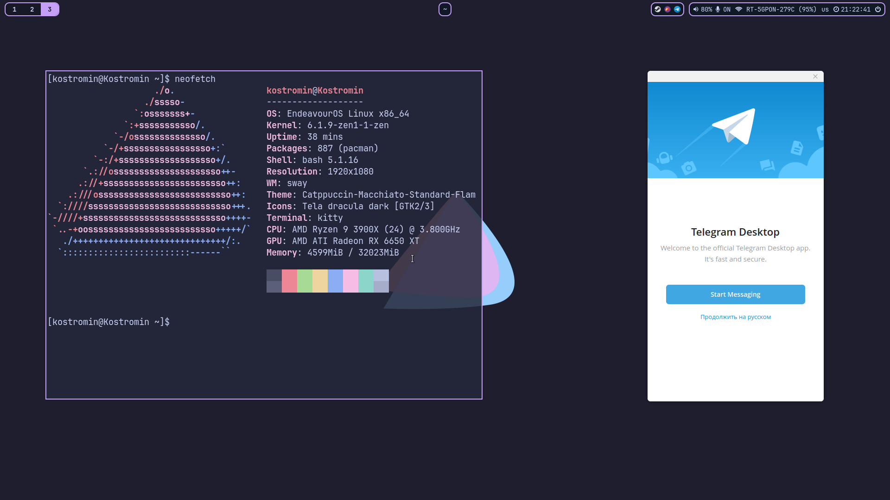

# dotfiles
EndeavourOS Sway setup

## Preview


## Install
```
yay -S kitty nerd-fonts-git wofi waybar mako wl-clipboard swayidle swaylock neovim brightnessctl flameshot wlogout xdg-desktop-portal xdg-desktop-portal-wlr xdg-desktop-gnome grim polkit-gnome tela-icon-theme nwg-look catppuccin-gtk-theme-macchiato
```
After copy configs to `~/.config`.
